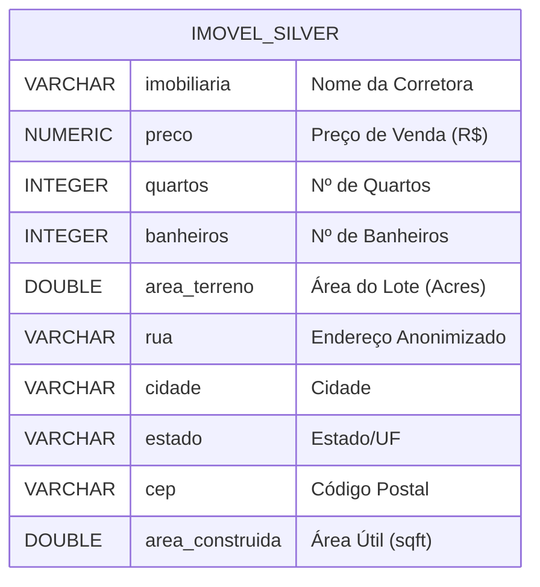

# Documentação de Modelagem de Dados - Camada Silver

## 1. Visão Geral
Este documento detalha a modelagem de dados da tabela `imoveis_silver`, que atua como a tabela fato unificada do Data Lakehouse. Esta tabela é o resultado do processo de ETL que funde, limpa e traduz os dados dos datasets `imoveis_padrao` e `imoveis_luxo`.

---

## 2. MER - Modelo Entidade-Relacionamento (Nível Conceitual)

O modelo conceitual representa a visão de negócio dos dados, abstraindo detalhes técnicos. Na camada Silver, trabalhamos com uma estrutura desnormalizada (Flat Table) para otimizar leituras analíticas.

### Entidade: `IMOVEL`
Representa uma unidade habitacional única disponível para venda.

* **Identificação:**
    * A entidade é identificada unicamente pelo conjunto de seus atributos no contexto do ETL, sem uma chave primária de negócio explícita na origem (CSV anonimizado).
* **Atributos Descritivos:**
    * **Dados Financeiros:** Preço de venda, Corretora responsável.
    * **Dados Físicos:** Quantidade de quartos, banheiros, área construída e área do terreno.
    * **Dados Geográficos:** Rua, Cidade, Estado e CEP.

---

## 3. DER - Diagrama Entidade-Relacionamento (Nível Lógico)

Abaixo, a representação visual da estrutura da tabela utilizando a notação *Mermaid*.

## 4. DLD - Diagrama Lógico de Dados (Nível Físico/Dicionário)

Especificação técnica baseada no DDL do PostgreSQL. Todas as colunas possuem restrição `NOT NULL` para garantir a qualidade "Silver" (dados limpos e completos).

**Tabela:** `imoveis_silver`

| Nome da Coluna | Tipo de Dado (SQL) | Tamanho | Restrições (Constraints) | Valor Padrão (Default) | Descrição |
| :--- | :--- | :--- | :--- | :--- | :--- |
| **imobiliaria** | `VARCHAR` | 255 | `NOT NULL` | `'Não Informado'` | Nome da imobiliária ou ID do broker. |
| **preco** | `NUMERIC` | 15, 2 | `NOT NULL` | - | Valor de venda. Precisão de 2 casas decimais. |
| **quartos** | `INTEGER` | - | `NOT NULL` | - | Quantidade de dormitórios. |
| **banheiros** | `INTEGER` | - | `NOT NULL` | - | Quantidade de banheiros. |
| **area_terreno** | `DOUBLE PRECISION` | - | `NOT NULL` | `0` | Área do terreno. Valor 0 indica apartamento. |
| **rua** | `VARCHAR` | 255 | `NOT NULL` | `'Não Informado'` | Endereço ou código de rua. |
| **cidade** | `VARCHAR` | 100 | `NOT NULL` | - | Nome da cidade formatado (Title Case). |
| **estado** | `VARCHAR` | 50 | `NOT NULL` | - | Nome do estado. |
| **cep** | `VARCHAR` | 20 | `NOT NULL` | `'00000'` | Código postal (armazenado como texto). |
| **area_construida**| `DOUBLE PRECISION` | - | `NOT NULL` | - | Área construída da residência. |

### Regras de Implementação (DDL)
1.  **Idempotência:** O script de criação utiliza `DROP TABLE IF EXISTS` para permitir reexecuções seguras do pipeline.
2.  **Tratamento de Nulos:** A restrição `NOT NULL` é aplicada em 100% das colunas. Dados ausentes são tratados no ETL (ex: preenchidos com defaults ou removidos) antes da inserção.
3.  **Tipagem Numérica:**
    * `NUMERIC(15,2)` para preços, evitando erros de ponto flutuante em cálculos financeiros.
    * `DOUBLE PRECISION` para áreas, permitindo maior flexibilidade em medidas geográficas.

# Histórico de Versão

| Data | Versão | Descrição | Autor |
| :---: | :---: | :--- | :--- |
| 17/01/2026 | `1.0` | Criação inicial do mer,der,dld. | [Diassis](https://github.com/Diaxiz) |

